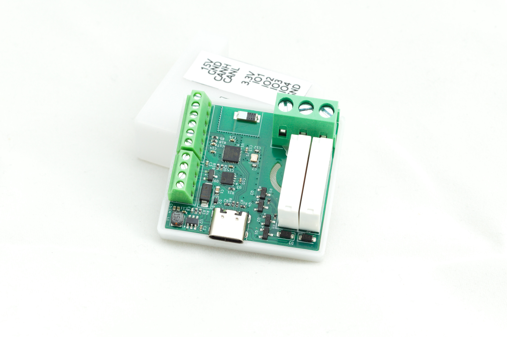

# ESPCAN 2GANG

**ESPCAN 2GANG** is an in-wall smart module powered by the **ESP32-C3 (ESP8685)**. It is designed to support **Home Assistant**, **ESPHome**, and the **CAN bus** protocol.

This compact device allows for the control of two independent 230V AC circuits and is small enough to fit into standard electrical junction boxes.

## Features
* **Dual Relay Output**: Control lighting or appliances (up to 5A per channel).
* **CAN Bus Integration**: Reliable wired communication via CANopen, perfect for environments with unstable Wi-Fi.
* **Expansion I/O**: 4 digital 3.3V inputs/outputs for physical buttons, reed switches, or sensors.
* **ESPHome Native**: Easy configuration and over-the-air (OTA) updates via CAN.

---

## Technical Specifications

| Component | Specification |
| :--- | :--- |
| **Microcontroller** | ESP8685 (ESP32-C3 RISC-V) |
| **Relay Load** | 2x 5A @ 230V AC |
| **Inputs/Outputs** | 4x Digital (3.3V Logic) |
| **Communication** | Wi-Fi (802.11b/g/n) + CAN Bus |
| **Dimensions** | 37 x 40 x 19 mm |

---

## Hardware Configuration (ESPHome)

The following tables breakdown the pinout and communication settings defined in the firmware.

### Pinout Mapping

| Function | GPIO | ESPHome ID | Type |
| :--- | :--- | :--- | :--- |
| **Relay 1** | `GPIO2` | `switch1` | Output (Internal) |
| **Relay 2** | `GPIO8` | `switch2` | Output (Internal) |
| **CAN TX** | `GPIO7` | - | Communication |
| **CAN RX** | `GPIO6` | - | Communication |

### CAN Bus & CANopen Setup

| Parameter | Value | Description |
| :--- | :--- | :--- |
| **Bit Rate** | `125kbps` | Standard CAN bus speed |
| **Node ID** | `10` | Unique ID on the CAN network |
| **OTA Platform** | `canopen` | Support for updates over CAN |
| **Queue Length**| `2048` | RX buffer size |

### Object Dictionary (Entities)

These indices are used for communication with the CAN gateway/Home Assistant.

| Entity | Index | TPDO | Unit |
| :--- | :--- | :--- | :--- |
| **Uptime** | `1` | `0` | Days |
| **Switch 1** | `2` | `1` | Binary (On/Off) |
| **Switch 2** | `3` | `1` | Binary (On/Off) |

---

## Usage Example

To use this device with **ESPHome**, ensure you have the `canopen` external components included in your configuration. The relays are marked as `internal: true` to prioritize control via the CAN bus gateway, but this can be adjusted for standard Wi-Fi use.

### Connection Diagram (Physical Buttons)
Connect your physical wall switches between any of the 4 available I/O pins and **GND**. 
> **Warning:** These inputs are **3.3V only**. Never connect 230V AC to the GPIO pins.

## License

This project is licensed under the **Creative Commons Attribution-NonCommercial-NoDerivs 4.0 International** license.

Under this license, you are free to share, copy, and redistribute the material in any medium or format, provided you follow these terms:
* **Attribution:** You must give appropriate credit.
* **Non-Commercial:** You may not use the material for commercial purposes.
* **NoDerivatives:** If you remix, transform, or build upon the material, you may not distribute the modified material.

For full details, please refer to the license links below:
* [English Version (CC BY-NC-ND 4.0)](https://creativecommons.org/licenses/by-nc-nd/4.0/deed.en)
* [Wersja Polska (CC BY-NC-ND 4.0)](https://creativecommons.org/licenses/by-nc-nd/4.0/deed.pl)

---
*Created by Wojciech Macek <wojciech.macek@gmail.com>*
